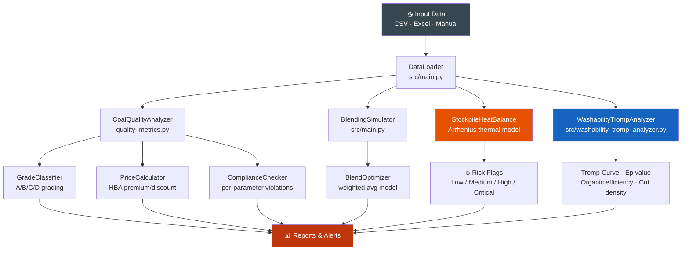

# Coal Quality Analyzer

[](https://www.python.org/downloads/)
[](LICENSE)
[]()
[]()
[]()
[]()

> **End-to-end coal quality analytics toolkit** — parameter analysis, reporting-basis conversion (AR / AD / DB / DAF), blending simulation, blend-ratio optimisation against buyer specs, export price benchmarking, HGI grindability interpretation, washability / Tromp curve analysis, stockpile thermal risk modelling, and specification compliance against Newcastle / ICI / HBA benchmarks — built in Python for Indonesian thermal coal operations.

Built for coal trading, mine operations, lab QC, and export compliance workflows across Kalimantan and Sumatra. All formulae follow ASTM D3180, ISO 17246 (proximate analysis), and ISO 1928 (calorific value).

## Install

```bash
git clone https://github.com/achmadnaufal/coal-quality-analyzer.git
cd coal-quality-analyzer
pip install -r requirements.txt
```

Requires Python 3.9 or newer. Dependencies: `pandas`, `numpy`, `scipy`, `matplotlib`, `rich`.

### Quickstart — load demo data and run quality analysis

```python
import pandas as pd
from quality_metrics import CoalQualityAnalyzer

df = pd.read_csv("demo/sample_data.csv")

reports = []
for _, row in df.iterrows():
    a = CoalQualityAnalyzer(
        sample_id=row["sample_id"],
        ash_percent=row["ash_adb_pct"],
        moisture_percent=row["total_moisture_pct"],
        sulfur_percent=row["total_sulfur_pct"],
        calorific_value_mj_kg=row["calorific_value_adb_kcal_kg"] / 238.8,
        volatile_matter_percent=row["volatile_matter_adb_pct"],
        fixed_carbon_percent=row["fixed_carbon_adb_pct"],
    )
    reports.append(a.analyze())

print(pd.DataFrame(reports)[["sample_id", "quality_grade", "net_calorific_mj_kg"]].head())
```

The sample contains 20 realistic Indonesian coal records across seven major producers (Kaltim Prima, Adaro, Bayan, Berau, ITM, Kideco, Banpu).

---

## Features

| Module | File | Capability |
|---|---|---|
| **Quality Analysis** | `quality_metrics.py` | GCV, ash, moisture, sulfur, VM — full proximate analysis |
| **Grade Classification** | `quality_metrics.py` | Premium / high / medium / low tiers from composite score |
| **Basis Converter** | `src/moisture_bases_converter.py` | AR ↔ AD ↔ DB ↔ DAF per ASTM D3180 / ISO 17246 |
| **Blending Simulator** | `quality_metrics.py`, `src/coal_blending_quality_predictor.py` | Linear mass-weighted blend of two or more sources |
| **Blend Ratio Optimizer** | `src/blend_ratio_optimizer.py` | LP solver hitting a target CV under ash / sulfur / moisture caps (e.g. Newcastle NAR 6000) |
| **Calorific Value Predictor** | `src/calorific_value_predictor.py` | Dulong / Boie formulae from ultimate & proximate analysis |
| **Price Calculator** | `quality_metrics.py`, `src/thermal_price_index_calculator.py` | Premium / discount vs HBA, ICI 4, Newcastle |
| **Spec Compliance Checker** | `quality_metrics.py`, `src/export_compliance.py` | Per-parameter violation detail against buyer spec |
| **Contract Compliance Checker** | `coal_quality/compliance_checker.py` | Lot-level PASS/FAIL, penalty calc, vendor performance summary |
| **Quality Deviation Report** | `src/quality_deviation_report.py` | Batch severity classification + aggregate statistics |
| **HGI Analyzer** | `src/hardgrove_grindability_analyzer.py` | ISO 5074 moisture correction, Bond W_i, mill kWh/t de-rate |
| **SO2 Emission Estimator** | `src/sulfur_dioxide_emission_estimator.py` | Stoichiometric SO2 with FGD / ash retention |
| **Washability & Tromp** | `src/washability_tromp_analyzer.py` | Float-sink table, Tromp partition, Ep, organic efficiency (AS 4156.1) |
| **Stockpile Heat Model** | `src/stockpile_heat_balance_calculator.py`, `src/spontaneous_combustion_risk*.py` | Arrhenius thermal simulation, self-heating risk flags |
| **Ash Fusion Interpreter** | `src/ash_fusion_temperature_interpreter.py` | IDT / ST / HT / FT temperature interpretation |
| **Wash Plant Yield** | `src/wash_plant_yield_calculator.py` | Yield reconciliation and recovery modelling |

---

## Quick Start

```bash
git clone https://github.com/achmadnaufal/coal-quality-analyzer.git
cd coal-quality-analyzer
pip install -r requirements.txt

# CLI demo: sample analysis + grade + export premium + compliance + blending
python3 demo/run_demo.py
```

### Demo output

```text
$ python3 demo/run_demo.py
================================================================
Coal Quality Analyzer — demo run
================================================================

1) Sample analysis (LOT-2026-04-19):
   sample_id                LOT-2026-04-19
   ash_percent              11.2
   moisture_percent         12.5
   sulfur_percent           0.65
   gross_calorific_mj_kg    24.8
   net_calorific_mj_kg      0.0
   quality_grade            premium

2) Quick grade (static API): classify_coal_grade(ash, sulfur)
   ash=10.0% sulfur=0.60%  →  premium
   ash=14.0% sulfur=1.00%  →  high_grade
   ash=16.0% sulfur=1.40%  →  standard
   ash=22.0% sulfur=2.50%  →  low_grade

3) Export premium vs HBA $90/t benchmark, 25.0 MJ/kg:
   Adjusted price: $88.20/t  (discount)
   Total adj:      $-1.80/t   GCV ratio: 0.98

4) Buyer specification compliance:
   Compliant: True  |  Compliance rate: 100.0%
     ✓ gcv        value=24.8   min=23.0 max=None
     ✓ ash        value=11.5   min=None max=12.0
     ✓ sulfur     value=0.65   min=None max=1.0
     ✓ moisture   value=12.0   min=None max=14.0

5) Blending 60/40 — Source A (premium) + Source B (low-grade):
   gcv        5160.0
   ash        11.18
   sulfur     0.74
   moisture   13.2
```

### Running Tests

```bash
# Run the full test suite
pytest tests/ -v --tb=short

# Run only the core analyzer tests
pytest tests/test_analyzer.py -v

# Run with coverage report
pytest tests/ --cov=. --cov-report=term-missing
```

### Using the Sample Data

A ready-to-use demo dataset with 20 realistic Indonesian coal samples (Kaltim Prima, Adaro, Bayan, Berau, Indo Tambangraya, Kideco, Banpu) is in `demo/sample_data.csv`. All proximate values are reported on the **air-dried basis (ADB)** per ASTM D3180 / ISO 17246; total moisture and sulfur are reported on the as-received basis:

```python
import pandas as pd
from quality_metrics import CoalQualityAnalyzer

df = pd.read_csv("demo/sample_data.csv")

results = []
for _, row in df.iterrows():
    analyzer = CoalQualityAnalyzer(
        sample_id=row["sample_id"],
        ash_percent=row["ash_adb_pct"],
        moisture_percent=row["total_moisture_pct"],
        sulfur_percent=row["total_sulfur_pct"],
        calorific_value_mj_kg=row["calorific_value_adb_kcal_kg"] / 238.8,  # kcal/kg -> MJ/kg
        volatile_matter_percent=row["volatile_matter_adb_pct"],
        fixed_carbon_percent=row["fixed_carbon_adb_pct"],
    )
    results.append(analyzer.analyze())

summary = pd.DataFrame(results)
print(summary[["sample_id", "quality_grade", "net_calorific_mj_kg"]])
```

**Columns:** `sample_id`, `mine_site`, `seam`, `sample_date`,
`total_moisture_pct` (AR), `ash_adb_pct`, `volatile_matter_adb_pct`,
`fixed_carbon_adb_pct`, `total_sulfur_pct` (AR), `calorific_value_adb_kcal_kg`,
`hgi`.

### Basis Conventions

Coal quality values depend on the moisture state at which the sample was
analysed. This project uses ASTM D3180 / ISO 17246 bases throughout:

| Code | Name | Includes |
|---|---|---|
| **AR** (ARB, GAR) | As-Received | Surface moisture + inherent moisture + dry matter |
| **AD** (ADB, GAD) | Air-Dried | Inherent moisture only (lab-equilibrated at ~60 % RH, 25 °C) |
| **DB** (Dry) | Dry | No moisture |
| **DAF** | Dry-Ash-Free | No moisture, no ash — organic fraction only |

Use `src/moisture_bases_converter.py` to convert any parameter between
bases.

---

## New: Quality Deviation Report

`src/quality_deviation_report.py` compares a batch of coal samples against
buyer/spec limits and emits per-parameter deviation severities
(`within_spec` / `minor` / `major` / `critical`), batch statistics (mean,
stdev, min, max, out-of-spec ratio), and an overall compliance ratio.

**Capabilities:**
- Immutable `QualitySample`, `ParameterSpec`, `SampleReport`, `BatchReport`
  dataclasses (all frozen — see coding-style rule on immutability)
- Severity bands scaled by a per-parameter `minor_tolerance`
- Strict input validation: invalid `basis`, negative or out-of-plausible-range
  numeric values, missing parameters, and inverted spec bounds all raise
  `ValueError` with actionable messages
- Zero-dependency (standard library only)

### Step-by-step usage

```python
from src.quality_deviation_report import (
    ParameterSpec, QualitySample, analyze_batch,
)

specs = [
    ParameterSpec("calorific_value_kcal_kg", min_value=5000.0, minor_tolerance=100.0),
    ParameterSpec("total_moisture_pct", max_value=30.0, minor_tolerance=1.0),
    ParameterSpec("ash_pct", max_value=10.0, minor_tolerance=0.5),
    ParameterSpec("total_sulphur_pct", max_value=0.8, minor_tolerance=0.1),
]

samples = [
    QualitySample("KAL-001", "ar", 4850, 28.5, 6.8, 40.2, 52.7, 0.38),
    QualitySample("KAL-007", "ar", 5520, 18.2, 12.4, 35.2, 53.4, 0.72),
]

report = analyze_batch(samples, specs)
print(f"Compliance: {report.compliance_ratio:.0%} ({report.compliant_count}/{report.total_samples})")
for sample_report in report.sample_reports:
    print(sample_report.sample_id, sample_report.worst_severity.value)
```

**Example output**

```
Compliance: 50% (1/2)
KAL-001 minor
KAL-007 critical
```

---

## New: SO2 Emission Estimator

`src/sulfur_dioxide_emission_estimator.py` estimates sulfur dioxide (SO2)
emissions from burning coal, returning kg SO2 per tonne and per MWh — ready
for environmental compliance reporting and boiler benchmarking.

**Capabilities:**
- Stoichiometric SO2 calculation (S + O2 -> SO2, factor 2.0 kg SO2 / kg S)
- Combustion ash-retention correction (fraction of S trapped in fly/bottom ash)
- FGD (flue-gas desulfurization) abatement credit
- Net electricity-based intensity (kg SO2 / MWh) using plant thermal efficiency
- Regulatory threshold check (`exceeds_threshold`)
- Batch processing for CSV-loaded datasets

### Step-by-step usage

**1. Single sample**

```python
import sys
sys.path.insert(0, "src")

from sulfur_dioxide_emission_estimator import CoalSample, estimate_so2_emission

sample = CoalSample(
    sample_id="KAL-001",
    total_sulfur_pct=0.38,          # % air-dried basis
    calorific_value_kcal_kg=4850,   # kcal/kg
    plant_efficiency_pct=36.0,      # subcritical PC boiler
    fgd_efficiency_pct=0.0,         # no FGD
    combustion_retention_pct=2.0,   # 2 % S retained in ash (AP-42 default)
)

result = estimate_so2_emission(sample)
print(f"SO2: {result.so2_kg_per_tonne:.2f} kg/t")
print(f"SO2: {result.so2_kg_per_mwh:.4f} kg/MWh")
print(f"Raw emission factor: {result.emission_factor_raw_kg_per_tonne:.2f} kg/t")
```

**2. With FGD abatement**

```python
sample_fgd = CoalSample(
    sample_id="KAL-002",
    total_sulfur_pct=1.2,
    calorific_value_kcal_kg=5200,
    fgd_efficiency_pct=90.0,   # 90 % SO2 capture
)

result_fgd = estimate_so2_emission(sample_fgd)
print(f"FGD reduces SO2 by {result_fgd.fgd_reduction_kg_per_tonne:.2f} kg/t")
print(f"Net SO2: {result_fgd.so2_kg_per_tonne:.2f} kg/t")
```

**3. Regulatory threshold check**

```python
from sulfur_dioxide_emission_estimator import exceeds_threshold

LIMIT_KG_PER_MWH = 0.03   # example national emission standard

if exceeds_threshold(result, threshold_kg_per_mwh=LIMIT_KG_PER_MWH):
    print("WARNING: emission limit exceeded — FGD or blend adjustment required")
else:
    print("Compliant with emission standard")
```

**4. Batch estimation from CSV**

```python
import pandas as pd
from sulfur_dioxide_emission_estimator import CoalSample, estimate_batch

df = pd.read_csv("demo/sample_data.csv")

samples = [
    CoalSample(
        sample_id=row["sample_id"],
        total_sulfur_pct=row["total_sulfur_pct"],
        calorific_value_kcal_kg=row["calorific_value_adb_kcal_kg"],
    )
    for _, row in df.iterrows()
]

results = estimate_batch(samples)
for r in results:
    print(f"{r.sample_id}: {r.so2_kg_per_tonne:.2f} kg SO2/t  |  {r.so2_kg_per_mwh:.4f} kg/MWh")
```

---

## New: Hardgrove Grindability (HGI) Analyzer

`src/hardgrove_grindability_analyzer.py` interprets HGI lab results to
estimate pulveriser performance, mill power consumption, and buyer-spec
compliance for thermal coal.

**Capabilities:**
- ISO 5074 Annex B moisture correction of as-measured HGI
- Categorical class: `very_hard`, `hard`, `medium`, `soft`, `very_soft`
- Bond Work Index (kWh/short ton) via `W_i = 435 / HGI^1.25`
- Mill specific energy (kWh/tonne) scaled from a 12 kWh/t baseline at HGI 50
- Capacity de-rate vs the HGI = 50 reference mill curve
- Buyer specification screening (default window 45 <= HGI <= 65)
- Batch processing for CSV-loaded datasets

### Step-by-step usage

**1. Single sample**

```python
import sys
sys.path.insert(0, "src")

from hardgrove_grindability_analyzer import HGISample, analyze_sample

sample = HGISample(
    sample_id="KAL-001",
    hgi=52.0,                  # as-measured HGI
    surface_moisture_pct=3.0,  # field moisture at point of test
    ash_pct=12.5,
)

result = analyze_sample(sample)
print(f"Corrected HGI:    {result.hgi_corrected:.2f}")
print(f"Class:            {result.grindability_class.value}")
print(f"Mill kWh/t:       {result.mill_specific_energy_kwh_per_t:.2f}")
print(f"Bond W_i (kWh/st): {result.bond_work_index_kwh_per_short_ton:.2f}")
print(f"Capacity de-rate: {result.capacity_derate_pct:+.1f}%")
```

**2. Buyer specification screening**

```python
from hardgrove_grindability_analyzer import meets_specification

if meets_specification(result, min_hgi=45, max_hgi=65):
    print("HGI within buyer window")
else:
    print("Off-spec: blend or reject")
```

**3. Batch from the demo CSV**

```python
import pandas as pd
from hardgrove_grindability_analyzer import HGISample, analyze_batch

df = pd.read_csv("demo/sample_data.csv")
samples = [
    HGISample(
        sample_id=row["sample_id"],
        hgi=row["hgi"],
        surface_moisture_pct=row["total_moisture_pct"],
        ash_pct=row["ash_adb_pct"],
    )
    for _, row in df.iterrows()
]

for r in analyze_batch(samples):
    print(f"{r.sample_id}: HGI={r.hgi_corrected:5.1f}  "
          f"{r.grindability_class.value:9s}  "
          f"{r.mill_specific_energy_kwh_per_t:5.2f} kWh/t")
```

---

## New: Blend Ratio Optimizer

`src/blend_ratio_optimizer.py` solves the real-world stockyard question — *what
proportions of my available coal piles hit the target CV while staying under
the ash, sulfur, and moisture caps in the sales contract?* It supports both a
closed-form binary blend and an n-source linear program (scipy HiGHS backend).

**Capabilities:**
- Closed-form two-source solver: O(1), zero solver dependency, used for barge
  loading and rail dispatch where only two stockpiles feed the shiploader.
- N-source LP solver (`scipy.optimize.linprog`, HiGHS method) minimising
  `|blend_cv - target|` subject to linear cap constraints on ash, sulfur,
  and moisture.
- Immutable `CoalSource`, `BlendTarget`, `BlendResult` frozen dataclasses.
- Physical-range validation: raises `ValueError` on CV outside
  `[1000, 8000]` kcal/kg, ash / moisture outside `[0, 100] %`, sulfur
  outside `[0, 10] %`, or duplicate `source_id` values.
- Diagnostic infeasibility handling: when no blend satisfies every cap,
  returns a uniform `1/n` fallback with `feasible=False` and a human-readable
  violation list so operators can see which cap forced the reject.

### Step-by-step — Newcastle NAR 6000 spec gate

```python
import sys
sys.path.insert(0, "src")

from blend_ratio_optimizer import BlendTarget, CoalSource, optimize_blend

# Three stockpiles (all ADB)
sources = [
    CoalSource("KPC-Pinang", cv_kcal_kg=6820, ash_pct=5.4,
               total_sulfur_pct=0.42, moisture_pct=16.8),
    CoalSource("ADR-Wara",   cv_kcal_kg=5250, ash_pct=4.1,
               total_sulfur_pct=0.19, moisture_pct=30.5),
    CoalSource("BYN-Perkasa", cv_kcal_kg=6050, ash_pct=6.2,
               total_sulfur_pct=0.58, moisture_pct=21.8),
]

# Newcastle NAR 6000-style buyer spec
newcastle = BlendTarget(
    target_cv_kcal_kg=6000,
    max_ash_pct=15.0,
    max_sulfur_pct=0.80,
    max_moisture_pct=14.0,   # NAR basis — adjust if you report ADB
    cv_tolerance_kcal_kg=50,
)

result = optimize_blend(sources, newcastle)
print(f"Feasible:      {result.feasible}")
print(f"Spec-compliant: {result.meets_specification}")
print(f"Blended CV:    {result.blended_cv_kcal_kg} kcal/kg "
      f"(deviation {result.cv_deviation_kcal_kg:+.1f})")
for src, ratio in zip(sources, result.ratios):
    print(f"  {src.source_id:12s}: {ratio:.1%}")
for v in result.violations:
    print(f"  ! {v}")
```

---

## Usage Examples

### Grade Classification

```python
from quality_metrics import CoalQualityAnalyzer

analyzer = CoalQualityAnalyzer()

params = {
    "calorific_value_mj_kg": 25.2,
    "ash_percent":            9.0,
    "moisture_percent":      11.0,
    "sulfur_percent":         0.6,
}
grade = analyzer.classify_coal_grade(params)
print(f"Grade:         {grade['coal_grade']}")     # Grade A
print(f"Quality Score: {grade['quality_score']}")  # 87.3
print(f"Market:        {grade['target_market']}")  # Export — Japan/Korea
```

### Export Price vs HBA Benchmark

```python
result = CoalQualityAnalyzer.calculate_export_premium(
    gcv_mj_kg=24.5,
    ash_pct=9.2,
    sulfur_pct=0.7,
    moisture_pct=11.5,
    benchmark_price_usd=90.0,
    benchmark_gcv=25.0,
)
print(f"Adjusted price: ${result['adjusted_price_usd_per_tonne']:.2f}/t")  # $87.40/t
print(f"Premium/Disc:   {result['premium_or_discount']} (${result['total_adjustment_usd']:.2f})")
```

### Specification Compliance Check

```python
params = {"gcv": 24.8, "ash": 11.5, "sulfur": 0.65, "moisture": 12.0}
spec   = {
    "gcv":      {"min": 23.0},
    "ash":      {"max": 12.0},
    "sulfur":   {"max": 1.0},
    "moisture": {"max": 14.0},
}
check = CoalQualityAnalyzer.check_specification_compliance(params, spec)
print(f"Compliant:       {check['compliant']}")           # True
print(f"Compliance rate: {check['compliance_rate']}%")    # 100.0%
print(f"Violations:      {check['violations']}")          # []
```

### Contract Specification Compliance

```python
from coal_quality.compliance_checker import ComplianceChecker, ContractSpec, InspectionResult

checker = ComplianceChecker()
spec = ContractSpec(
    contract_id="CTR-001", buyer_name="Power Plant A", coal_grade="GCV5800",
    ash_max_pct=14.0, sulfur_max_pct=0.70, moisture_max_pct=18.0,
    gcv_min_mjkg=23.0, price_usd_t=65.0, penalty_per_excess_unit=2.5,
    acceptance_tolerance_pct=5.0,
)
result = InspectionResult(
    lot_id="LOT-2024-01", contract_id="CTR-001", sample_date="2026-01-15",
    ash_pct=14.8, sulfur_pct=0.65, moisture_pct=17.5,
    gcv_mjkg=22.8, size_fraction_pct=92, foreign_matter_pct=0.5,
)
check = checker.check_single_lot(result, spec)
print(f"Lot {result.lot_id}: {check['overall_status']} — penalties: ${check['total_penalty']:.2f}")
# Lot LOT-2024-01: FAIL — penalties: $3.75

# Multi-lot aggregate compliance
from coal_quality.compliance_checker import ComplianceChecker, ContractSpec, InspectionResult

checker = ComplianceChecker()
mc = checker.check_multi_lot([result, another_lot], spec)
print(f"Pass rate: {mc['pass_rate_pct']:.1f}%  |  Total penalties: ${mc['total_penalties']:.2f}")

# Lot risk classification
risk = checker.lot_risk_classification(result, spec)
print(f"Risk: {risk['overall_risk']} — {risk['risk_signal']}")

# Acceptance probability (logistic model)
prob = checker.acceptance_probability(result, spec)
print(f"Acceptance probability: {prob:.2%}")

# Vendor performance summary
perf_df = checker.vendor_performance_summary([(result, spec), (lot2, spec2)])
print(perf_df[['vendor', 'total_lots', 'pass_rate_pct', 'avg_penalty_usd_t']])
```
```

### Blending Simulation

```python
from src.main import CoalBlendingSimulator

sim = CoalBlendingSimulator()

# Blend two coal stocks to meet GAR 5,000 kcal/kg spec
blend = sim.optimize_blend(
    source_a={"gcv": 5800, "ash": 8.5, "sulfur": 0.5, "moisture": 10.0},
    source_b={"gcv": 4200, "ash": 15.2, "sulfur": 1.1, "moisture": 18.0},
    target_gcv=5000,
)
print(f"Optimal ratio: {blend['ratio_a']:.1%} A + {blend['ratio_b']:.1%} B")
print(f"Blended GCV:   {blend['blended_gcv']:.0f} kcal/kg")
print(f"Blended Ash:   {blend['blended_ash']:.1f}%")
```

---

## 🏗️ Architecture



---

## 📁 Project Structure

```
coal-quality-analyzer/
├── src/
│   ├── main.py                # Core analysis + blending logic
│   └── data_generator.py      # Synthetic sample data generator
├── quality_metrics.py         # Grade, pricing, compliance modules
├── validators.py              # Input validation and bounds checking
├── data/                      # Data directory (real data gitignored)
├── sample_data/
│   └── realistic_data.csv     # 100 sample coal quality records
├── examples/                  # Usage examples and notebooks
├── tests/                     # 40+ unit tests
├── demo/
│   └── sample_output.md       # Example analysis outputs
├── requirements.txt
├── CONTRIBUTING.md
└── LICENSE
```

---

## 🗺️ Demo Output

```
=== COAL QUALITY BATCH ANALYSIS ===
Loaded: 100 samples from realistic_data.csv

Summary Statistics:
  Parameter    Mean     Std     Min     Max
  GCV (MJ/kg)  24.7    1.82    20.1    28.4
  Ash (%)      10.8    2.34     6.1    18.9
  Sulfur (%)    0.68   0.21     0.32    1.42
  Moisture (%) 12.4    2.61     7.8    19.5

Grade Distribution:
  Grade A (Premium):   23%   GCV > 26 MJ/kg
  Grade B (Standard):  41%   GCV 23–26 MJ/kg
  Grade C (Low):       29%   GCV 20–23 MJ/kg
  Grade D (Off-spec):   7%   GCV < 20 MJ/kg

Price Analysis vs HBA $90/t:
  Avg adjustment:  -$2.40/t
  Premium samples: 31 (31%)
  Discount samples: 69 (69%)

Stockpile Risk Assessment:
  Critical risk: 2 samples (auto-combustion likely)
  High risk:     8 samples (monitor closely)
  Medium risk:  24 samples (weekly checks)
  Low risk:     66 samples (routine monitoring)
```

### 🧪 Washability & Tromp Curve — Example Output

```python
from src.washability_tromp_analyzer import WashabilityTrompAnalyzer, FloatSinkFraction

fractions = [
    FloatSinkFraction(1.30, 1.35, mass_pct=12.5, ash_pct=3.2,  gcv_adb_kcal_kg=6450),
    FloatSinkFraction(1.35, 1.40, mass_pct=18.3, ash_pct=5.8,  gcv_adb_kcal_kg=6280),
    FloatSinkFraction(1.40, 1.45, mass_pct=22.1, ash_pct=9.4,  gcv_adb_kcal_kg=6050),
    FloatSinkFraction(1.45, 1.50, mass_pct=15.7, ash_pct=14.6, gcv_adb_kcal_kg=5720),
    FloatSinkFraction(1.50, 1.60, mass_pct=14.2, ash_pct=22.3, gcv_adb_kcal_kg=5190),
    FloatSinkFraction(1.60, float('inf'), mass_pct=17.2, ash_pct=48.9, gcv_adb_kcal_kg=3850),
]
result = WashabilityTrompAnalyzer(fractions, target_ash_pct=10.0, misplacement_factor=0.08).analyse()
```

```
=== Float-Sink Washability Analysis — Kalimantan Thermal Coal ===

Feed ash:              17.41%
Target product ash:    10.0%

Washability Results:
  Theoretical yield @ target ash:  77.6%   (maximum possible clean coal)
  Optimal DMS cut density:          1.52 RD
  Actual yield @ cut density:      57.2%
  Organic efficiency:              73.7%   (actual / theoretical)

Dense Medium Separation Efficiency:
  Ep value:    0.200  (Ecart Probable — lower = sharper separation)
  Product ash @ 1.52 RD cut:   10.00%  ✅ Meets buyer spec
  Reject ash  @ 1.52 RD cut:   43.07%

Tromp Partition Curve:
  Cut density  1.52 RD → partition number 0.497
  (0.0 = perfect float product, 1.0 = perfect sink — midpoint at cut density)
```

---

## 🛠️ Tech Stack

| Tool | Purpose |
|---|---|
| **Python 3.9+** | Core analysis |
| **pandas** | Data ingestion and batch processing |
| **numpy** | Thermal modeling (Arrhenius equation) |
| **scipy** | Blending optimization |
| **pytest** | Unit testing (40+ tests) |

---

## 🧪 Testing

```bash
pytest tests/ -v --tb=short
```

---

## 🤝 Contributing

See [CONTRIBUTING.md](CONTRIBUTING.md). Contributions welcome — especially new grade classification standards (GAR vs NAR conversion, ASTM D5865), price index integrations (Argus, Platts), or new export market specs (India, China, Vietnam).

---

## 📄 License

MIT License — see [LICENSE](LICENSE) for details.

---

> Built by [Achmad Naufal](https://github.com/achmadnaufal) | Lead Data Analyst | Power BI · SQL · Python · GIS
