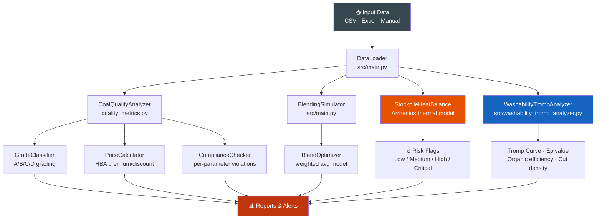

# ⛏️ Coal Quality Analyzer

[](https://www.python.org/downloads/)
[](LICENSE)
[]()
[]()
[]()
[]()

> **End-to-end coal quality analytics for Indonesian thermal coal operations** — grade classification, blending simulation, export price benchmarking, stockpile thermal risk modeling, and specification compliance — all in Python.

Built for coal trading, mine operations, and export compliance workflows across Kalimantan and Sumatra operations.

---

## 🚀 Features

| Module | Capability |
|---|---|
| 🔬 **Quality Analysis** | GCV, ash, moisture, sulfur, volatile matter — full proximate analysis |
| 🏷️ **Grade Classification** | Automatic A/B/C/D grading by calorific value and quality parameters |
| ⚖️ **Blending Simulator** | Blend two or more coal sources to meet buyer specification |
| 💵 **Price Calculator** | Export premium/discount vs HBA, ICI 4, and Newcastle benchmarks |
| ✅ **Compliance Checker** | Per-parameter violation detail against buyer spec limits |
| 🌡️ **Stockpile Heat Model** | Arrhenius thermal simulation — spontaneous combustion risk flags |
| 📊 **Batch Processing** | Analyze CSV/Excel batches with summary statistics |
| 🧪 **Washability & Tromp Analyzer** *(v2.3)* | Float-sink washability table, Tromp partition curve, Ep value, optimal cut density, and organic efficiency per AS 4156.1 / Napier-Munn methodology |

---

## 📦 Quick Start

```bash
git clone https://github.com/achmadnaufal/coal-quality-analyzer.git
cd coal-quality-analyzer
pip install -r requirements.txt
```

---

## 💡 Usage Examples

### Grade Classification

```python
from quality_metrics import CoalQualityAnalyzer

analyzer = CoalQualityAnalyzer()

params = {
    "calorific_value_mj_kg": 25.2,
    "ash_percent":            9.0,
    "moisture_percent":      11.0,
    "sulfur_percent":         0.6,
}
grade = analyzer.classify_coal_grade(params)
print(f"Grade:         {grade['coal_grade']}")     # Grade A
print(f"Quality Score: {grade['quality_score']}")  # 87.3
print(f"Market:        {grade['target_market']}")  # Export — Japan/Korea
```

### Export Price vs HBA Benchmark

```python
result = CoalQualityAnalyzer.calculate_export_premium(
    gcv_mj_kg=24.5,
    ash_pct=9.2,
    sulfur_pct=0.7,
    moisture_pct=11.5,
    benchmark_price_usd=90.0,
    benchmark_gcv=25.0,
)
print(f"Adjusted price: ${result['adjusted_price_usd_per_tonne']:.2f}/t")  # $87.40/t
print(f"Premium/Disc:   {result['premium_or_discount']} (${result['total_adjustment_usd']:.2f})")
```

### Specification Compliance Check

```python
params = {"gcv": 24.8, "ash": 11.5, "sulfur": 0.65, "moisture": 12.0}
spec   = {
    "gcv":      {"min": 23.0},
    "ash":      {"max": 12.0},
    "sulfur":   {"max": 1.0},
    "moisture": {"max": 14.0},
}
check = CoalQualityAnalyzer.check_specification_compliance(params, spec)
print(f"Compliant:       {check['compliant']}")           # True
print(f"Compliance rate: {check['compliance_rate']}%")    # 100.0%
print(f"Violations:      {check['violations']}")          # []
```

### Blending Simulation

```python
from src.main import CoalBlendingSimulator

sim = CoalBlendingSimulator()

# Blend two coal stocks to meet GAR 5,000 kcal/kg spec
blend = sim.optimize_blend(
    source_a={"gcv": 5800, "ash": 8.5, "sulfur": 0.5, "moisture": 10.0},
    source_b={"gcv": 4200, "ash": 15.2, "sulfur": 1.1, "moisture": 18.0},
    target_gcv=5000,
)
print(f"Optimal ratio: {blend['ratio_a']:.1%} A + {blend['ratio_b']:.1%} B")
print(f"Blended GCV:   {blend['blended_gcv']:.0f} kcal/kg")
print(f"Blended Ash:   {blend['blended_ash']:.1f}%")
```

---

## 🏗️ Architecture



---

## 📁 Project Structure

```
coal-quality-analyzer/
├── src/
│   ├── main.py                # Core analysis + blending logic
│   └── data_generator.py      # Synthetic sample data generator
├── quality_metrics.py         # Grade, pricing, compliance modules
├── validators.py              # Input validation and bounds checking
├── data/                      # Data directory (real data gitignored)
├── sample_data/
│   └── realistic_data.csv     # 100 sample coal quality records
├── examples/                  # Usage examples and notebooks
├── tests/                     # 40+ unit tests
├── demo/
│   └── sample_output.md       # Example analysis outputs
├── requirements.txt
├── CONTRIBUTING.md
└── LICENSE
```

---

## 🗺️ Demo Output

```
=== COAL QUALITY BATCH ANALYSIS ===
Loaded: 100 samples from realistic_data.csv

Summary Statistics:
  Parameter    Mean     Std     Min     Max
  GCV (MJ/kg)  24.7    1.82    20.1    28.4
  Ash (%)      10.8    2.34     6.1    18.9
  Sulfur (%)    0.68   0.21     0.32    1.42
  Moisture (%) 12.4    2.61     7.8    19.5

Grade Distribution:
  Grade A (Premium):   23%   GCV > 26 MJ/kg
  Grade B (Standard):  41%   GCV 23–26 MJ/kg
  Grade C (Low):       29%   GCV 20–23 MJ/kg
  Grade D (Off-spec):   7%   GCV < 20 MJ/kg

Price Analysis vs HBA $90/t:
  Avg adjustment:  -$2.40/t
  Premium samples: 31 (31%)
  Discount samples: 69 (69%)

Stockpile Risk Assessment:
  Critical risk: 2 samples (auto-combustion likely)
  High risk:     8 samples (monitor closely)
  Medium risk:  24 samples (weekly checks)
  Low risk:     66 samples (routine monitoring)
```

### 🧪 Washability & Tromp Curve — Example Output

```python
from src.washability_tromp_analyzer import WashabilityTrompAnalyzer, FloatSinkFraction

fractions = [
    FloatSinkFraction(1.30, 1.35, mass_pct=12.5, ash_pct=3.2,  gcv_adb_kcal_kg=6450),
    FloatSinkFraction(1.35, 1.40, mass_pct=18.3, ash_pct=5.8,  gcv_adb_kcal_kg=6280),
    FloatSinkFraction(1.40, 1.45, mass_pct=22.1, ash_pct=9.4,  gcv_adb_kcal_kg=6050),
    FloatSinkFraction(1.45, 1.50, mass_pct=15.7, ash_pct=14.6, gcv_adb_kcal_kg=5720),
    FloatSinkFraction(1.50, 1.60, mass_pct=14.2, ash_pct=22.3, gcv_adb_kcal_kg=5190),
    FloatSinkFraction(1.60, float('inf'), mass_pct=17.2, ash_pct=48.9, gcv_adb_kcal_kg=3850),
]
result = WashabilityTrompAnalyzer(fractions, target_ash_pct=10.0, misplacement_factor=0.08).analyse()
```

```
=== Float-Sink Washability Analysis — Kalimantan Thermal Coal ===

Feed ash:              17.41%
Target product ash:    10.0%

Washability Results:
  Theoretical yield @ target ash:  77.6%   (maximum possible clean coal)
  Optimal DMS cut density:          1.52 RD
  Actual yield @ cut density:      57.2%
  Organic efficiency:              73.7%   (actual / theoretical)

Dense Medium Separation Efficiency:
  Ep value:    0.200  (Ecart Probable — lower = sharper separation)
  Product ash @ 1.52 RD cut:   10.00%  ✅ Meets buyer spec
  Reject ash  @ 1.52 RD cut:   43.07%

Tromp Partition Curve:
  Cut density  1.52 RD → partition number 0.497
  (0.0 = perfect float product, 1.0 = perfect sink — midpoint at cut density)
```

---

## 🛠️ Tech Stack

| Tool | Purpose |
|---|---|
| **Python 3.9+** | Core analysis |
| **pandas** | Data ingestion and batch processing |
| **numpy** | Thermal modeling (Arrhenius equation) |
| **scipy** | Blending optimization |
| **pytest** | Unit testing (40+ tests) |

---

## 🧪 Testing

```bash
pytest tests/ -v --tb=short
```

---

## 🤝 Contributing

See [CONTRIBUTING.md](CONTRIBUTING.md). Contributions welcome — especially new grade classification standards (GAR vs NAR conversion, ASTM D5865), price index integrations (Argus, Platts), or new export market specs (India, China, Vietnam).

---

## 📄 License

MIT License — see [LICENSE](LICENSE) for details.

---

> Built by [Achmad Naufal](https://github.com/achmadnaufal) | Lead Data Analyst | Power BI · SQL · Python · GIS
